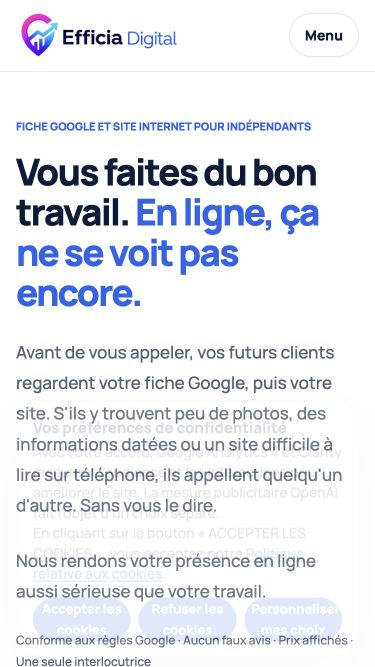
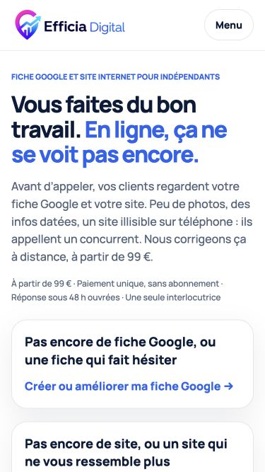
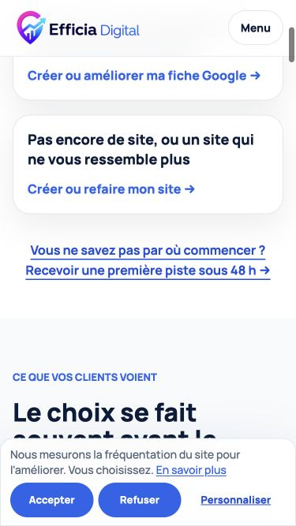
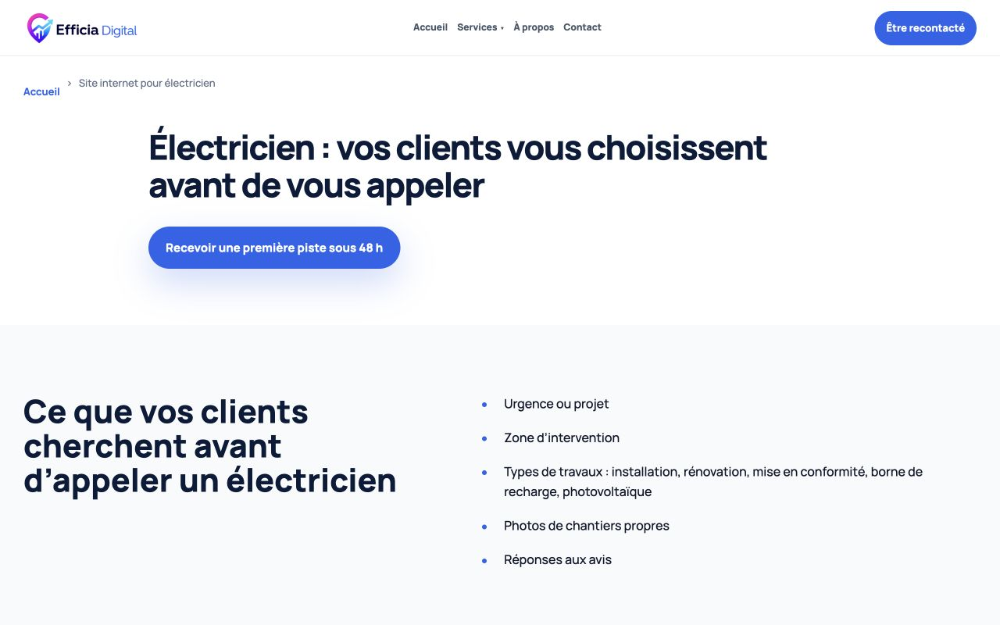

# Rapport des modifications — 8 octobre 2026

## Base vérifiée et isolation

Branche : `conversion-mobile-oct2026`, créée explicitement sur `9a8ad690d9768684b0616a95b69c69c25c74fd09` après `git fetch --all`.
Ce commit comprend la nouvelle arborescence du 7 octobre, le menu/versionnement `7b633a4` du 8 octobre et GA4. Le bundle de secours n’a pas été nécessaire.

Comparaison HTTP avant modification : accueil, Services, À propos, Optimisation Google Business, Audit, CSS/JS du menu, CSS/JS cookies, GA4, analytics et sitemap identiques octet pour octet aux fichiers publics. Sur Contact et Refonte, seules les adresses e-mail protégées et le script de décodage injectés par Cloudflare diffèrent. Aucun élément du menu ou du consentement ne manque dans la base retenue.

Le dépôt initial `efficia-v2` est resté sur sa branche et son commit, avec ses modifications non commitées préservées. Deux créations de worktree y ont échoué sur `mmap failed: Operation canceled`. Pour contourner cette erreur sans réinitialiser ni stasher les fichiers, une copie Git indépendante a été récupérée dans `../efficia-conversion-base.git`, puis le worktree courant créé dans `../efficia-conversion-mobile` sur le SHA vérifié. Une référence de branche sur la base peut subsister dans le dépôt initial après la tentative échouée ; la branche contenant les cinq commits est celle de ce worktree.

Aucun push, déploiement, envoi réel de formulaire ni changement de configuration de production.

## Résultat par phase

1. Barre WhatsApp/contact sous 768 px après 300 px de défilement, espace de fin de page et safe area. Absente sur Contact, masquée pendant cookies/préférences/menu. En-tête et menu mobile modifiés. Premier niveau cookies compact, actions Accepter/Refuser équivalentes. Panneau détaillé et toute la logique de consentement comparés au fichier de base : strictement identiques. Zones tactiles agrandies, styles focus et mouvement réduit.
2. Textes de l’accueil repris, H1 et meta description conservés, prix site 990 € TTC, pack sans montant, réalisation anonymisée, étapes et fondatrice. Les mentions publiques de gratuité du diagnostic ont été retirées sans changer les ancres ou son mécanisme. Le comparatif aux avis fictifs de la page Google a été retiré.
3. Un seul gestionnaire de clics GA4 par délégation. `whatsapp_click`, `contact_cta_click`, et `generate_lead` avec sujet borné aux valeurs du select, exclusivement après le succès confirmé du formulaire. Les identifiants de demande restent locaux, aucune coordonnée ni message dans les paramètres GA4. Consentement, restriction aux domaines HTTPS de production et retrait conservés.
4. Title/og:title de l’accueil, locale belge, catalogue JSON-LD avec prix 99 et prix minimum 990. Audit complet et cohérent après nettoyage des anciennes mentions : lien ajouté sur Services et au footer. Mentions légales/CGV déjà `noindex, follow` : elles restent hors sitemap. Dates des pages modifiées actualisées.
5. Page électricien, mêmes composants et réalisation anonymisée, liens internes, footer « Par métier », sitemap et liste GA4. Contrôles finaux, ajustements des débordements (coordonnées Contact, halos Google), renouvellement des URL CSS/JS modifiées et mise à jour des assertions de tests rendues obsolètes par les textes demandés.

## Vérifications

- **90 tests ciblés réussis, 0 échec, 0 ignoré** : openaiAds, technicalSeoRoutes, privacyAnalytics, publicDiagnosticLanding, auditGoogleBusinessPage, siteRequest, environmentIsolation, ga4Consent et contactConversion. Commande avec `MINIFLARE_MODULE` pointant sur le runtime Miniflare 4 déjà installé ; aucune dépendance npm ajoutée.
- Les tests de parcours Chrome couvrent acceptation, refus, finalités séparées, retrait, SDK bloqué, rechargement, validations et erreurs du diagnostic. Les nouvelles vérifications du formulaire Contact couvrent le reçu `sent`, un mauvais identifiant, les erreurs HTTP/réseau et la conservation des champs en échec.
- Tests serveur et navigateur **simulés/localement** ; aucun e-mail envoyé. Réception réelle dans GA4 non testée. GA4 reste volontairement désactivé sur localhost et les previews ; ses événements sont vérifiés dans le harnais de test sur une origine de production simulée.
- 32 contrôles : accueil et sept pages principales, aux formats 375 × 667, 390 × 844, 768 × 1024 et 1280 × 800. Aucun débordement horizontal après correction ; barre inexistante sur Contact et masquée sur ordinateur. Résultats : `docs/conversion-mobile/pages-viewports.json` et `viewports.json`.
- À 375 × 667 : première carte Google à **451,6 px** contre **705,9 px** avant. Elle est visible sans défilement ; le H1 est inchangé. Bandeau cookies : **111,6 px** sur 375/390 px (safe area non simulée, elle s’ajoute sur les appareils concernés).
- Menu mobile : ouverture, fermeture par Échap et retour du focus vérifiés. Préférences : réouverture via le footer, choix indépendants audience/publicité et retour du focus vérifiés. Aucun script de mesure chargé après refus. La barre se masque pendant le bandeau et les préférences.
- 11 blocs JSON-LD analysés sans erreur ; sitemap XML bien formé ; pas de doublon d’id ni de lien local manquant dans les documents publics. `git diff --check` et vérifications de syntaxe JS réussis.
- Styles ajoutés : contrastes de marque conservés (bleu/blanc, navy/blanc, texte sombre sur fond clair), minimum tactile 44 px (48 px pour la barre), focus visible et transitions désactivées en mouvement réduit. Contrôle clavier ciblé, sans prétendre à une certification d’accessibilité ou à des tests physiques Safari/iPhone.

## Captures

Avant/après de l’accueil :

Deux captures client anonymisées intégrées, sans lien sortant ni identité dans le HTML :

- `assets/images/realisation-electricien-bruxelles-mobile.webp` : **780 × 1688**, viewport 390 × 844, densité 2, **39 780 octets**.
- `assets/images/realisation-electricien-bruxelles-desktop.webp` : **1440 × 900**, **80 202 octets**.

Nom/logo et textes identifiants masqués **dans la page avant capture**. Vérification visuelle de chaque image finale : aucun nom, logo identifiable ou coordonnée lisible. **Tesseract indisponible, donc pas de vérification OCR.** WebP qualité 80, sans EXIF, XMP ni profil ICC. Aucun placeholder nécessaire. Les PNG intermédiaires de ces deux captures et les scripts temporaires sont supprimés ; seules les versions WebP sont suivies pour la réalisation.

## Paramètres et éléments en attente de Fatima

- `GBP_URL` reste vide en haut de `js/conversion.js` : aucun lien visible et aucune URL inventée dans `sameAs`. Renseigner cette constante lorsque la vraie fiche est disponible.
- `WHATSAPP_URL` est centralisée dans ce même fichier et appliquée aux liens existants et créés.
- Prix d’appel du site conservé en HTML pour le rendu sans JavaScript et le SEO : `index.html`, `services.html`, `refonte-site-internet.html`. `index.html` contient aussi `minPrice: "990"` dans le JSON-LD. À modifier ensemble si le prix évolue.
- Accord du client pour être nommé : toujours en attente. La version livrée reste entièrement anonymisée ; cet accord n’est pas nécessaire pour conserver cette présentation anonyme.
- Audit : page complète, liens ajoutés conformément au critère du prompt ; aucune décision bloquante restante. Fatima peut décider ultérieurement de retirer cette offre.
- Publication non demandée : les changements sont uniquement locaux et commités.

## Écarts et précisions

- Captures réalisées avec le navigateur Chromium intégré et son interface CDP (équivalent à Playwright), sans installer de dépendance. Floutage injecté avant capture ; la capture mobile initialement exportée en pixels CSS a été remplacée par la version native à densité 2.
- Ajout de la valeur générique `footer` à `contact_cta_click`, en plus des six emplacements demandés : des liens Contact existent au footer ; cela permet de mesurer tous les liens sans attribuer faussement ces clics au hero ou à l’appel final. Les autres valeurs demandées sont conservées.
- La page métier utilise les formulations/énumérations fournies, sans témoignage ni promesse supplémentaire. Le composant de réalisation est identique dans les deux HTML (site statique sans outil de compilation).
- La recherche globale « garanti » rencontre encore les dénégations de classement et les clauses légales préexistantes, qui ne promettent aucun résultat. Elles ont été conservées. « Gratuit » dans la FAQ Google décrit la gratuité du produit Google, pas une offre Efficia ; la capture contient le bouton de demande de devis du site illustré. Les routes historiques et identifiants techniques du diagnostic sont conservés pour ne pas casser les liens ni la logique. Les outils admin ne font pas partie des pages publiques.
- Les assertions de tests qui exigeaient les anciens textes cookies, le comparatif fictif ou l’ancien nombre de liens ont été adaptées au nouveau contrat, en conservant les vérifications de consentement, des formulaires, des prix et de confidentialité.

## Fichiers par commit de phase

### Phase 1 : faciliter le contact mobile et compacter les cookies — `7f6afe4`

- `404.html`
- `a-propos.html`
- `achat.html`
- `audit-google-business.html`
- `cgv.html`
- `contact.html`
- `css/conversion.css`
- `css/site-navigation.css`
- `index.html`
- `js/conversion.js`
- `js/cookies.js`
- `js/site-navigation.js`
- `mentions-legales.html`
- `optimisation-google-business.html`
- `paiement-reussi.html`
- `politique-confidentialite.html`
- `politique-cookies.html`
- `refonte-site-internet.html`
- `services.html`

### Phase 2 : préciser les offres et présenter une réalisation anonymisée — `c1af377`

- `404.html`
- `assets/images/realisation-electricien-bruxelles-desktop.webp`
- `assets/images/realisation-electricien-bruxelles-mobile.webp`
- `audit-google-business.html`
- `cgv.html`
- `contact.html`
- `css/conversion.css`
- `index.html`
- `optimisation-google-business.html`
- `politique-confidentialite.html`
- `politique-cookies.html`
- `refonte-site-internet.html`
- `services.html`

### Phase 3 : mesurer les contacts GA4 uniquement après consentement — `c7ab910`

- `js/contact.js`
- `js/ga4.js`
- `tests/ga4Consent.test.js`

### Phase 4 : compléter les données structurées et les liens SEO — `f1bc658`

- `a-propos.html`
- `audit-google-business.html`
- `cgv.html`
- `contact.html`
- `index.html`
- `mentions-legales.html`
- `optimisation-google-business.html`
- `politique-confidentialite.html`
- `politique-cookies.html`
- `refonte-site-internet.html`
- `services.html`
- `sitemap.xml`

### Phase 5 et validation finale

- `404.html`
- `RAPPORT-MODIFICATIONS.md`
- `a-propos.html`
- `achat.html`
- `assets/images/realisation-electricien-bruxelles-mobile.webp`
- `audit-google-business.html`
- `cgv.html`
- `contact.html`
- `css/conversion.css`
- `docs/conversion-mobile/apres-375.png`
- `docs/conversion-mobile/avant-375.png`
- `docs/conversion-mobile/cookies-375.png`
- `docs/conversion-mobile/electricien-1280.png`
- `docs/conversion-mobile/pages-viewports.json`
- `docs/conversion-mobile/viewports.json`
- `functions/diagnostic-gratuit.js`
- `index.html`
- `js/conversion.js`
- `js/ga4.js`
- `mentions-legales.html`
- `optimisation-google-business.html`
- `paiement-reussi.html`
- `politique-confidentialite.html`
- `politique-cookies.html`
- `refonte-site-internet.html`
- `services.html`
- `site-internet-electricien.html`
- `sitemap.xml`
- `tests/auditGoogleBusinessPage.test.js`
- `tests/contactConversion.test.js`
- `tests/ga4Consent.test.js`
- `tests/privacyAnalytics.test.js`
- `tests/publicDiagnosticLanding.test.js`
- `tests/technicalSeoRoutes.test.js`
